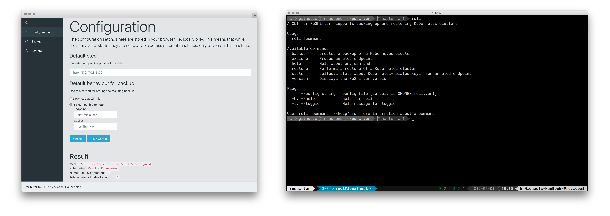

# ReShifter

[](https://goreportcard.com/report/github.com/mhausenblas/reshifter)
[](https://godoc.org/github.com/mhausenblas/reshifter)
[](https://quay.io/repository/mhausenblas/reshifter)
[](https://app.swaggerhub.com/apis/mhausenblas/reshifter/1.0.0)

A cluster admin backup and restore tool for Kubernetes distros such as OpenShift, using etcd to query and manipulate the state of all objects.

[](https://www.useloom.com/share/e590aedeb95b441fb23ab4f9e9e80c32 "Introducing ReShifter")  

- [Use Cases](#use-cases)
- [Status and roadmap](#status-and-roadmap)
- [Deploy app locally](#deploy-app-locally)
- [Deploy app in OpenShift](#deploy-app-in-openshift)
- [Deploy app in Kubernetes](#deploy-app-in-kubernetes)
- [CLI tool](#cli-tool)
- [Configuration](#configuration)
- [Test and development](#test-and-development)

## Use Cases

There are many cases where ReShifter can be useful for you, for example:

- **Restore** When running a Kubernetes cluster in production, you can use ReShifter to back up the current state of the deployed apps and global resources such as namespaces. The backup can be useful as a basis for a restore process (into the same or a new cluster) or for auditing purposes.
- **Disaster Recovery** When operating two or more clusters, you can use ReShifter to replicate the state for DR failover scenarios.
- **$aving money** When running development or test clusters in a public cloud setting, you might not want to pay for the whole time, only when you actively use it. You can use ReShifter to snapshot the state, shut down the cluster and once ramped up again, restore the state.
- **Troubleshooting** For any kind of Kubernetes clusters, be it prod or testing, you can use ReShifter to capture the state of the cluster at a certain point in time for offline debugging and troubleshooting or to share the state with a provider, who then can take care of looking into a support case.
- **Upgrading** When you are upgrading a cluster, say, from Kubernetes 1.5 to 1.6, you can use ReShifter to achieve zero-downtime upgrades with minimal manual effort.

## Status and roadmap

See the [Trello board](https://trello.com/b/iOrEdJQ3/reshifter) for the current status of the work and roadmap items.
You can also check out the design philosophy and [architecture](https://github.com/mhausenblas/reshifter/blob/master/architecture.md)
of ReShifter, if you want to learn more about why it works the way it does.

## Deploy app locally

If you want to use the ReShifter app, that is the Web UI, you need to use the Docker image since it bundles the static assets such as HTML, CSS, and JS and the Go binary.
For example, to launch the ReShifter app locally, do:

```
$ docker run --rm -p 8080:8080 quay.io/mhausenblas/reshifter:0.3.10
```

If you want to use the ReShifter API, for example as a head-less service, you can simply use the binary, no other dependencies required:

```
$ curl -s -L https://github.com/mhausenblas/reshifter/releases/download/v0.3.10-alpha/reshifter -o reshifter
$ chmod +x reshifter
$ ./reshifter
```

The ReShifter HTTP API is defined in and available via Swagger: [swaggerhub.com/apis/mhausenblas/reshifter/1.0.0](https://swaggerhub.com/apis/mhausenblas/reshifter/1.0.0)

## Deploy app in OpenShift

To install the ReShifter app on OpenShift, we use a [Makefile](https://github.com/mhausenblas/reshifter/blob/master/Makefile)
that creates a new project called `reshifter`, launches the app from the Docker image, and finally exposes the service via a route
so that you can access the app from outside of the cluster. The following requires access to an OpenShift Origin 1.5 (or OpenShift Container Platform 3.5)
cluster and also the [oc](https://github.com/openshift/origin/releases/tag/v1.5.1) CLI tool locally installed:

```
$ make init
$ make publish
```

## Deploy app in Kubernetes

To install the ReShifter app in a portable way, use `kubectl` and the YAML files provided.
The following requires access to a vanilla Kubernetes 1.5 or above cluster and also the
[kubectl](https://kubernetes.io/docs/tasks/tools/install-kubectl/) CLI tool locally installed:

```
$ kubectl create -f https://raw.githubusercontent.com/mhausenblas/reshifter/master/deployments/reshifter-app.yaml
```

Note: the above YAML file defines both a `Deployment` as well as a `Service` object for ReShifter.
It does, however, not expose the ReShifter service to the outside world. If you want to access the app from outside the cluster,
you'll have to use Ingress or adapt the [YAML file](https://github.com/mhausenblas/reshifter/blob/master/deployments/reshifter-app.yaml)
yourself.

## CLI tool

ReShifter also provides for a CLI tool called `rcli`.
Get binary releases for Linux and macOS via the [GitHub release page](https://github.com/mhausenblas/reshifter/releases/tag/v0.3.10-alpha).

```
$ rcli -h
A CLI for ReShifter, supports backing up and restoring Kubernetes clusters.

Usage:
  rcli [command]

Available Commands:
  backup      Creates a backup of a Kubernetes cluster
  explore     Probes an etcd endpoint
  help        Help about any command
  restore     Performs a restore of a Kubernetes cluster
  stats       Collects stats about Kubernetes-related keys from an etcd endpoint
  version     Displays the ReShifter version

...
```

Here's a simple usage example which assumes that you've got a Kubernetes cluster with an etcd on `http://localhost:4001` running:

```
# explore the endpoint, overwrite default for etcd endpoint:
$ rcli explore -e http://localhost:4001

# collect stats using default for etcd endpoint:
$ rcli stats

# back up Kubernetes cluster to Minio playground:
$ ACCESS_KEY_ID=Q3AM3UQ867SPQQA43P2F \
  SECRET_ACCESS_KEY=zuf+tfteSlswRu7BJ86wekitnifILbZam1KYY3TG \
  rcli backup create -e http://localhost:4001 \
                     -r play.minio.io:9000 \
                     -b mh9-test

# restart/empty etcd now or launch a new one as a restore target

# restore cluster from Minio playground, using backup ID 1498815551:
$ ACCESS_KEY_ID=Q3AM3UQ867SPQQA43P2F \
  SECRET_ACCESS_KEY=zuf+tfteSlswRu7BJ86wekitnifILbZam1KYY3TG \
  rcli restore -e http://localhost:4001 \
               -r play.minio.io:9000 \
               -b mh9-test \
               -i 1498815551
```

## Configuration

ReShifter takes throughout the deployments (app, HTTP API, CLI) the following configuration parameters,
supplied as environment variables. Currently all of them are optional, but may be required depending on the etcd
setup in use or what you want to achieve, for example, backing up to an S3-compatible storage.

| env var   | meaning  | set for |
| ---------:| -------- | ------- |
| `ACCESS_KEY_ID` | S3 access key ID | when backing up to remote S3-compatible storage |
| `SECRET_ACCESS_KEY` | S3 secret access key | when backing up to remote S3-compatible storage |
| `RS_ETCD_CLIENT_CERT` | path to etcd client cert file | when using a secure etcd |
| `RS_ETCD_CLIENT_KEY` | path to etcd client key file | when using a secure etcd |
| `RS_ETCD_CA_CERT` | path to etcd CA cert file | when using a secure etcd |

Note:

- The `ACCESS_KEY_ID` and `SECRET_ACCESS_KEY` environment variables are understood as of the AWS [guidelines](http://docs.aws.amazon.com/general/latest/gr/managing-aws-access-keys.html)
- The `RS_ETCD_*` environment variables are understood as of the etcd2 [security flags](https://coreos.com/etcd/docs/latest/v2/configuration.html#security-flags)/etcd3 [security flags](https://coreos.com/etcd/docs/latest/op-guide/configuration.html#security-flags)

## Test and development

See the pages for [testbed](https://github.com/mhausenblas/reshifter/tree/master/testbed) and [development](https://github.com/mhausenblas/reshifter/blob/master/dev.md).
