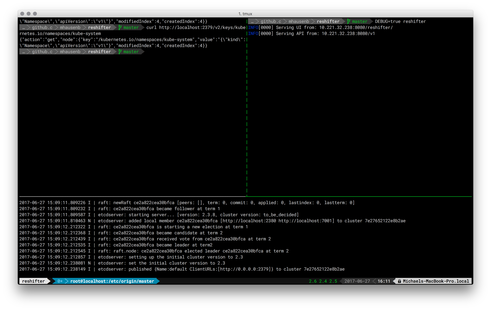

# ReShifter

[](https://goreportcard.com/report/github.com/mhausenblas/reshifter)
[](https://godoc.org/github.com/mhausenblas/reshifter)
[](https://quay.io/repository/mhausenblas/reshifter)
[](https://travis-ci.org/mhausenblas/reshifter)

A cluster admin backup and restore tool for Kubernetes distros such as OpenShift, using etcd to query and manipulate the state of all objects.

[](https://www.useloom.com/share/e590aedeb95b441fb23ab4f9e9e80c32 "Introducing ReShifter")  

Supported:

- Cluster: Kubernetes 1.5 compatible distros
- App: modern browsers

***Index:***

- [Using it](#using-it)
  - [Deploy it locally](#deploy-it-locally)
  - [Deploy it on OpenShift](#deploy-it-on-openshift)
  - [Deploy it on vanilla Kubernetes](#deploy-it-on-vanilla-kubernetes)
- [Testbed](#testbed)
  - [End-to-end tests](#end-to-end-tests)
  - [Synthetic tests](#synthetic-tests)
  - [Cluster dumps](#cluster-dumps)
- [Extending it](#extending-it)
  - [Vendoring](#vendoring)
  - [Builds and releases](#builds-and-releases)
  - [Unit tests](#unit-tests)

### Status and roadmap

See [Trello board](https://trello.com/b/iOrEdJQ3/reshifter).

## Using it

### Deploy it locally

If you want to use the ReShifter app, that is the Web UI, you need to use the Docker image since it bundles the static assets such as HTML, CSS, and JS and the Go binary.
For example, to launch the ReShifter app locally, do:

```
$ docker run --rm -p 8080:8080 quay.io/mhausenblas/reshifter:0.2.4
```

If you want to use the ReShifter API, for example as a head-less service, you can simply use the binary, no other dependencies required:

```
$ curl -s -L https://github.com/mhausenblas/reshifter/releases/download/v0.2.4-alpha/reshifter -o reshifter
$ chmod +x reshifter
$ ./reshifter
```

The ReShifter HTTP API is defined in and available via Swagger: [swaggerhub.com/apis/mhausenblas/reshifter/1.0.0](https://swaggerhub.com/apis/mhausenblas/reshifter/1.0.0)

### Deploy it on OpenShift

Note: requires an OpenShift 1.5 cluster and [oc](https://github.com/openshift/origin/releases/tag/v1.5.1) installed, locally.

```
$ make init
$ make publish
```

### Deploy it on vanilla Kubernetes

TBD.

## Testbed

There are three types of integration/perf/scale tests in ReShifter, all available in [testbed](https://github.com/mhausenblas/reshifter/tree/master/testbed/):

- end-to-end tests
- synthetic tests
- tests based on cluster dumps

### End-to-end tests

For end-to-end tests do the following. Note that each might take up to 30s and that you MUST execute them from within the `testbed/` directory:

```
$ cd testbed/
$ e2e-etcd2.sh
$ e2e-etcd3.sh
```

The end-to-end tests have the following dependencies:

- Docker CE (tested with v1.17)
- [etcdctl](https://github.com/coreos/etcd/tree/master/etcdctl)
- [http](https://httpie.org)
- [jq](https://stedolan.github.io/jq/)

The end-to-end test matrix is as follows:

|version   | insecure  | secure       |
| --------:| --------- | ------------ |
| 2.x      | available | available*   |
| 3.x      | available | available**  |

Legend:

- `*` … based on the etcd2 [security flags](https://coreos.com/etcd/docs/latest/v2/configuration.html#security-flags) and the etcd2 [security model](https://coreos.com/etcd/docs/latest/v2/security.html)
- `**` … based on the etcd3 [security flags](https://coreos.com/etcd/docs/latest/op-guide/configuration.html#security-flags) and the etcd3 [security model](https://coreos.com/etcd/docs/latest/op-guide/security.html)

See also the notes on [setting up etcd in a secure way](https://github.com/mhausenblas/reshifter/tree/master/testbed/certs/README.md) for more details on how to change or extend these tests.

### Synthetic tests

For synth tests, execute `testbed/gen-synth-testbed.sh`, which creates a number of Kubernetes objects and requires access to a Kubernetes cluster.

### Cluster dumps

TBD.


## Extending it

To extend ReShifter or fix issues, please consider the following.

### Builds and releases

Following [semantic versioning](http://semver.org/), the canonical ReShifter release version is defined in one place only,
in the [Makefile](https://github.com/mhausenblas/reshifter/blob/master/Makefile). This version is then used in the Go code, in the Docker image as a tag and for all downstream
deployments.

A new release (Linux binary on GitHub and image on quay.io) is cut using the following process:

```
# 1. Generate the binary:
$ make gbuild

# 2. Release on GitHub, using $reshifter_version

# 3. Build a container image locally and pushes it to quay.io:
$ make crelease
```

### Vendoring

We are using Go [dep](https://github.com/golang/dep) for dependency management.
If you don't have `dep` installed yet, do `go get -u github.com/golang/dep/cmd/dep` now and then:

```
$ dep ensure
```

### Unit tests

In general, for unit tests we use the `go test` command, for example:

```
$ cd pkg/backup/
$ go test -v
```

Please do make sure all unit tests pass before sending in a PR.
