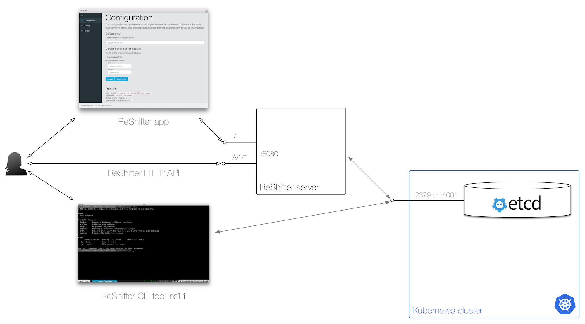

# Architecture, design considerations and prior art

## Architecture

ReShifter's architecture is as follows:

- You can make backups and restore of a Kubernetes cluster, either by storing the archive (ZIP file with the content of the underlying etcd) locally or in a remote location (S3-compatible object storage).
- Both the server (exposing a HTTP API) and the CLI tool `rcli`are leveraging the ReShifter library [github.com/mhausenblas/reshifter/pkg](https://godoc.org/github.com/mhausenblas/reshifter/pkg).
- All you need to supply is access to etcd in the form of a URl such as `http://localhost:2379`. If etcd is used in a secure more you'll need to supply the certs and key. If you want to back up to and restore from the remote storage, you'll additionally need to provide the credentials (access key ID and secret access key) for the S3-compatible object storage endpoint.

## Design considerations

The basic idea of ReShifter is to work against the etcd API. That means, backing up and restoring the state of
objects in a Kubernetes cluster on the etcd API level: not below as tools like `etcdctl` do it, and also not on a higher
level, such as using the Kubernetes API Server-level. This brings a couple of advantages and disadvantages into play:

- We're independent of what the API Server does or how many of them are there.
- We operate with the logical state of the objects, not a low-level representation of the serialization.
- We need to re-implement some of the logic already present in the API Server, for example, dealing with the different data models etcd v2 and v3 have.
- Performance-wise it should be on-par or better than the API Server-level.
- There will be challenges ahead with all sorts of encrypted content.
- There is state relevant to a Kubernetes cluster, outside of what is in etcd. One such an example are certificates. It is yet an open question to what extent, if at all ReShifter should take care of this.

## Prior art and related solutions

In the course of researching the backup/restore topic in the context of Kubernetes I've come across the following attempts, solutions, and proposals:

- Backup & restore with `etcdctl`, [v2](https://coreos.com/etcd/docs/latest/v2/admin_guide.html) and [v3](https://coreos.com/etcd/docs/latest/op-guide/recovery.html).
- [kubernetes/kubernetes/cluster/restore-from-backup.sh](https://github.com/kubernetes/kubernetes/blob/master/cluster/restore-from-backup.sh) by [Wojciech Tyczynski](https://github.com/wojtek-t)
- [ose-auto/backup.sh](https://github.com/sterburg/ose-auto/blob/master/backup.sh), master-config (etcd) and statefull data backup using pod (technology) discovery by [Samuel Terburg](https://github.com/sterburg)
- [kubernetes-incubator/bootkube](https://github.com/kubernetes-incubator/bootkube/blob/master/Documentation/disaster-recovery.md#bootkube-recover), a low-level recovery tool
- [pieterlange/kube-backup](https://github.com/pieterlange/kube-backup), a resource state sync to Git inspired by RANCID
- The OpenShift [Backup and Restore](https://docs.openshift.com/container-platform/3.5/admin_guide/backup_restore.html) docs
- Related Kubernetes issues are:
  - #[24229](https://github.com/kubernetes/kubernetes/issues/24229) Backup/migrate cluster?
  - #[21582](https://github.com/kubernetes/kubernetes/issues/21582) Kubectl needs export and import commands
