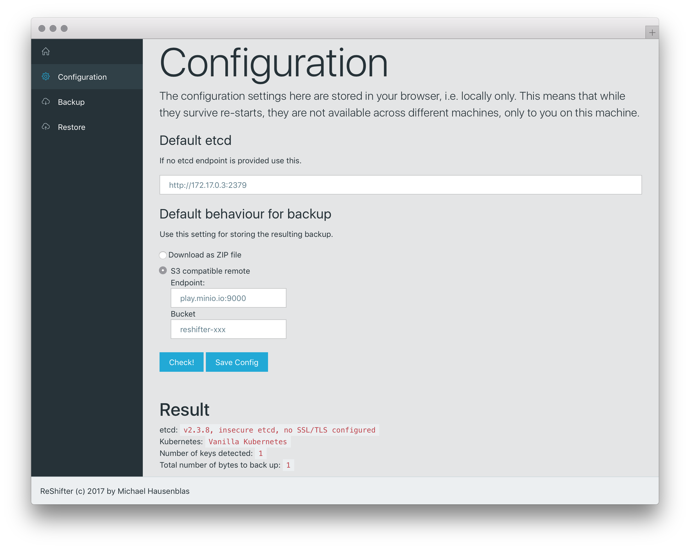

# Walkthroughs

Welcome to the ReShifter walkthroughs. Here, we guide you through both the CLI tool and the app, showing step by step what you can do and how to achieve it.

## CLI

This is the ReShifter CLI (`rcli`) walkthrough. Let's start with the simplest case—using the defaults:

```
# collect stats using default for etcd endpoint:
$ rcli stats

```

Here's a simple usage example which assumes that you've got a Kubernetes cluster with an etcd on `http://localhost:4001` running:

```
# explore the endpoint, overwrite default for etcd endpoint:
$ rcli explore --endpoint http://localhost:4001

# back up Kubernetes cluster to Minio playground:
$ ACCESS_KEY_ID=Q3AM3UQ867SPQQA43P2F \
  SECRET_ACCESS_KEY=zuf+tfteSlswRu7BJ86wekitnifILbZam1KYY3TG \
  rcli backup create --endpoint http://localhost:4001 \
                     --remote play.minio.io:9000 \
                     --bucket mh9-test

# restart/empty etcd now or launch a new one as a restore target

# restore cluster from Minio playground, using backup ID 1498815551:
$ ACCESS_KEY_ID=Q3AM3UQ867SPQQA43P2F \
  SECRET_ACCESS_KEY=zuf+tfteSlswRu7BJ86wekitnifILbZam1KYY3TG \
  rcli restore --endpoint http://localhost:4001 \
               --remote play.minio.io:9000 \
               --bucket mh9-test \
               --backupid 1498815551
```

## App

This is the ReShifter app (Web UI) walkthrough. Have a look at the following screen share (soon to be updated, the UI has changed dramatically):

[](https://www.useloom.com/share/e590aedeb95b441fb23ab4f9e9e80c32 "Introducing ReShifter")  
