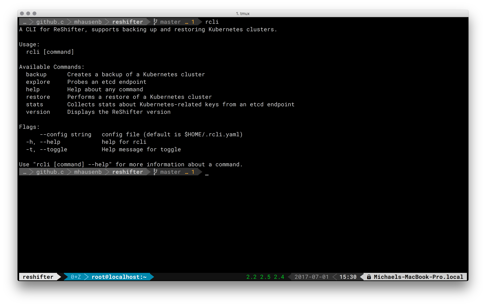

# Walkthroughs

Welcome to the ReShifter walkthroughs. Here, we guide you through both the CLI tool and the app, showing step by step what you can do and how to achieve it.

## CLI

This is the ReShifter CLI (`rcli`) walkthrough. Have a look at the following screen cast or see below for concrete examples you can copy and paste:

[](https://www.useloom.com/share/41d7ea95a0fa4131bf2ee140ea831266 "Screen cast: ReShifter CLI tool walkthrough")  

### Exploring

Let's start with the simplest case, exploring etcd and what it contains, in regards to Kubernetes. Note that in the following, we're dealing with an etcd3, using the v2 API.


Using the default value, that is, `http://127.0.0.1:2379` for the etcd endpoint, we can explore the setup like so:

```
$ rcli explore
Exploring etcd endpoint http://127.0.0.1:2379
etcd version: 3.1.0
API version: v2
Secure: insecure etcd, no SSL/TLS configured
Distro: Vanilla Kubernetes
```

As expected, we see an etcd 3.x with the v2 API in use and also learn that it's apparently an insecure setup. Last but not least we learn that apparently a vanilla Kubernetes distro is present.

Let's now find out a bit more about the backup volume by collecting stats, this time explicitly setting the etcd endpoint:

```
$ rcli stats --endpoint http://127.0.0.1:2379
Collecting stats from etcd endpoint http://127.0.0.1:2379
Vanilla Kubernetes [keys:5, size:890]
```

In above command we see that there are 5 keys in there with an overall payload of 890 bytes.

### Backing up into local directory

If nothing else is specified, `rcli` will default to creating backups in `/tmp/reshifter`:

```
$ rcli backup create
Successfully created backup: /tmp/reshifter/1500828455.zip

$ rcli backup list
1500828455

$ ls -al /tmp/reshifter/
total 24
drwx------   4 mhausenblas  wheel   136 23 Jul 18:47 .
drwxrwxrwt  36 root         wheel  1224 23 Jul 18:46 ..
-rw-r--r--   1 mhausenblas  wheel   995 23 Jul 18:47 1500828455.zip
```

### Backing up into remote S3-compatible storage

To create a backup in a bucket that lives in an S3-compatible storage, such as provided by AWS or GCP, do the following. Note that in this case we're using a bucket called `2017-07-23-reshifter` in the Minio playground with publicly known credentials; don't put stuff there that you don't want to share with others, though:

```
$ ACCESS_KEY_ID=Q3AM3UQ867SPQQA43P2F \
  SECRET_ACCESS_KEY=zuf+tfteSlswRu7BJ86wekitnifILbZam1KYY3TG \
  rcli backup create --remote play.minio.io:9000 \
                     --bucket 2017-07-23-reshifter
```

### Restoring from remote S3-compatible storage

Restore a cluster using the Minio playground with backup ID `1500828455`:

```
$ ACCESS_KEY_ID=Q3AM3UQ867SPQQA43P2F \
  SECRET_ACCESS_KEY=zuf+tfteSlswRu7BJ86wekitnifILbZam1KYY3TG \
  rcli restore --remote play.minio.io:9000 \
               --bucket mh9-test \
               --backupid 1500828455
```

### Strategies

[Strategies](strategies.md) allow you to influence the behavior of `rcli` when scanning etcd. In the following we will use the `filter` strategy to only back up keys that contain certain values, effectively white-listing them:

```
# only back up objects below '/namespaces/mycoolproject':
$ RS_BACKUP_STRATEGY=filter:/namespaces/mycoolproject rcli backup create

# only back up objects which path contains 'deployment' or 'service':
$ RS_BACKUP_STRATEGY=filter:deployment,service rcli backup create
```

### Overwrite auto-discovery

Sometimes, especially in situation where you're upgrading the platform, say, from Kubernetes 1.5 to 1.6, you will want to overwrite the built-in auto-discovery of the ReShifter library:

```
# make ReShifter use the etcd v2 API:
$ RS_ETCD_API_VERSION=v2 rcli backup create
```

## App

This is the ReShifter app (Web UI) walkthrough. Have a look at the following screen cast (soon to be updated, the UI has changed dramatically):

[](https://www.useloom.com/share/e590aedeb95b441fb23ab4f9e9e80c32 "Introducing ReShifter")  
